# Automate with Zapier

## Introduction

 
### What is Zapier?
 
Zapier is an online automation tool that lets you connect your apps, such as Gmail, Team Projects, and more, to each other. You can connect two or more apps to automate repetitive tasks without coding or relying on developers to build the integration. It's easy enough that anyone can build their own app workflows with just a few clicks.

### What is Swit?
 
Swit is San Francisco-based fastest growing remote working tool, which offers chat and tasks in one platform. Due to this revolutionary combination, Swit grants its users to easily monitor team collaboration. You can use our chat and tasks as remote working tools that can be particularly effective for remote participants to work together, allowing them to perform a collaborative dialogue or other group activity.

### How does it work?
 
In your Zapier account, your apps can be connected to work together. Each connection is called a “Zap.” With a Zap, you can set one of your selected apps to perform a specific action (called "Trigger"), which then would trigger the other app to perform a set action (called "Action"). For example, let’s say that you wish to push Gmail to a Swit project every time you receive a new email. The trigger, in this case, would be the new email in Gmail and the new project created in the Swit project through the trigger would be the Action. 

Zapier offers two types of triggers: (1) Polling Trigger and (2) Instant Trigger. When using the Polling Trigger, Zapier will check for a new update from your trigger every 1 to 15 minutes, depending on your subscription plan. When using the Instant Trigger, your trigger app will send Zapier an instant notification whenever there is a new update.

## Gmail & Swit

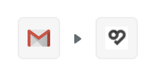

The purpose of this section is to demonstrate how to set up Zapier to automatically push data from Gmail to Swit. In order for Zapier to perform this task, you must first connect Gmail and Swit to Zapier. This will give Zapier secure access to read and/or write data to those apps. Please login to your Zapier and then follow the step-by-step directions below. Please keep in mind that, during setup, you’ll need to have your login credentials ready for all of the apps you want to connect.

### Getting Started

On the left-hand side of the screen, you find the Make a New Zap button when you hover your mouse cursor over the + sign. Click on the link to proceed.

### When this happens ...

You will be directed to the “1. When this happens …” page. 

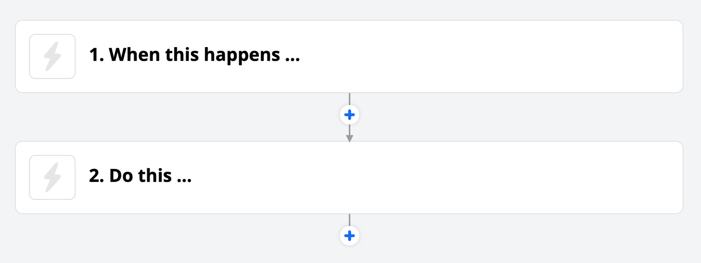

Under Choose App & Event, search for and select the “Gmail” app that will trigger the Zap. 

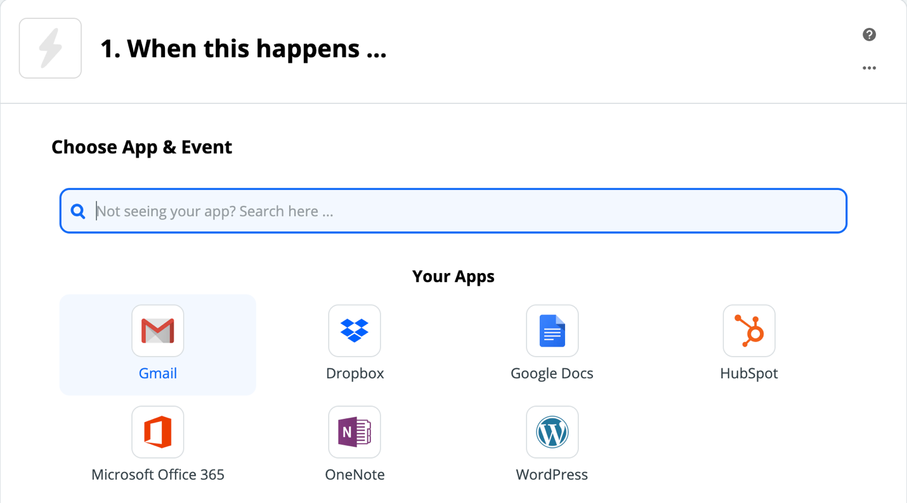

Then, select the Choose Trigger Event dropdown menu, which will provide a list of available connections.

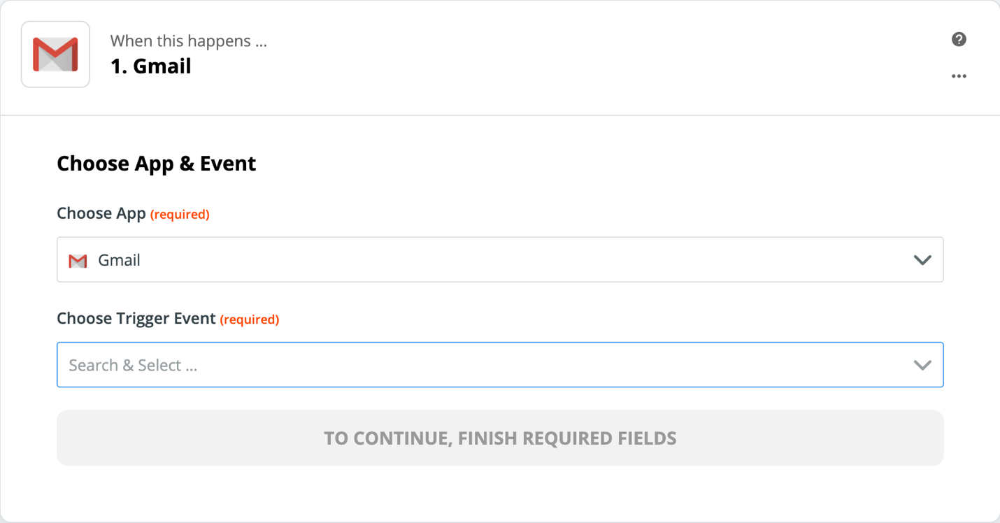

- New Email Matching Search: Triggers when you receive a new email that matches a search string you provide.
- New Thread: Triggers when a new thread starts.
- New Email: Triggers when a new e-mail appears in the specified mailbox.
- New Labeled Email: Triggers when you receive a new email and label it within two days.
- New Starred Email: Triggers when you receive a new email and star it within two days.
- New Attachment: Triggers when you receive a new attachment (triggers once per attachment).
- New Label: Triggers when you add a new label.

Choose one that best fits your needs. I will choose New Email to demonstrate. Then press Continue to proceed.

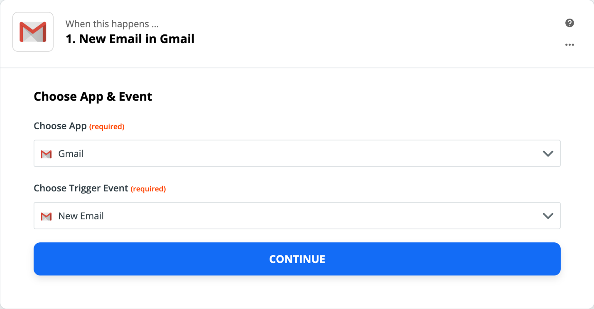

Moving onto the next step, you will be asked to connect your G Suite Gmail account with Zapier. If you are already logged in to your Gmail account, you will only need to allow Zapier to access your Google Account. Click on the dropdown and choose your Gmail account. Press Continue to proceed.

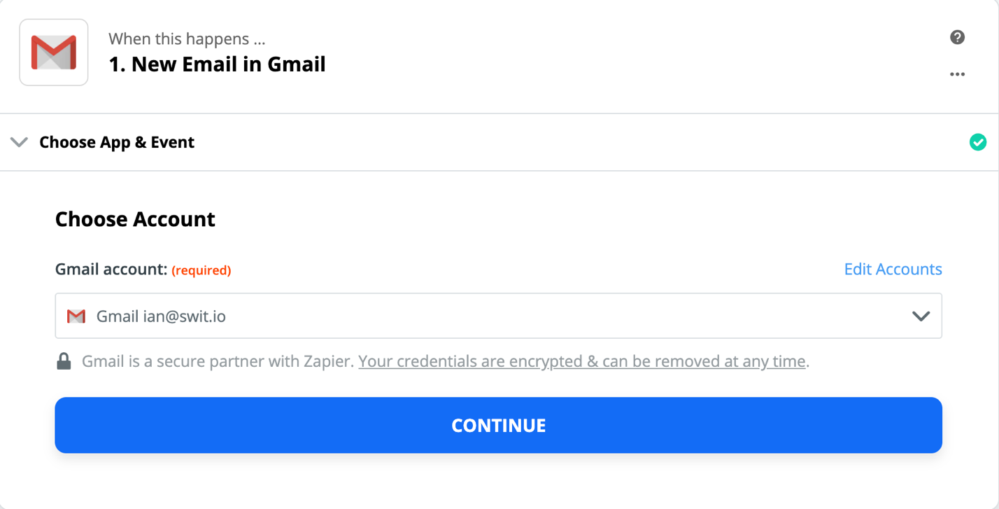

Customize Email allows you to select which new emails with which specific label or mailbox get sent to Swit (The possible selections are as follows: Chat, Sent, Inbox, Import, Trash, Draft, Spam, Category_Forums, Category_Updates, Category_Personal, Category_Promotions, Category_Social, Stared, and Unread). If no label or mailbox is selected, this Zap will trigger on all emails, including Drafts. For this example, we will select Inbox. To do so, click on the dropdown button at the right of the Label/Mailbox, and select Inbox.

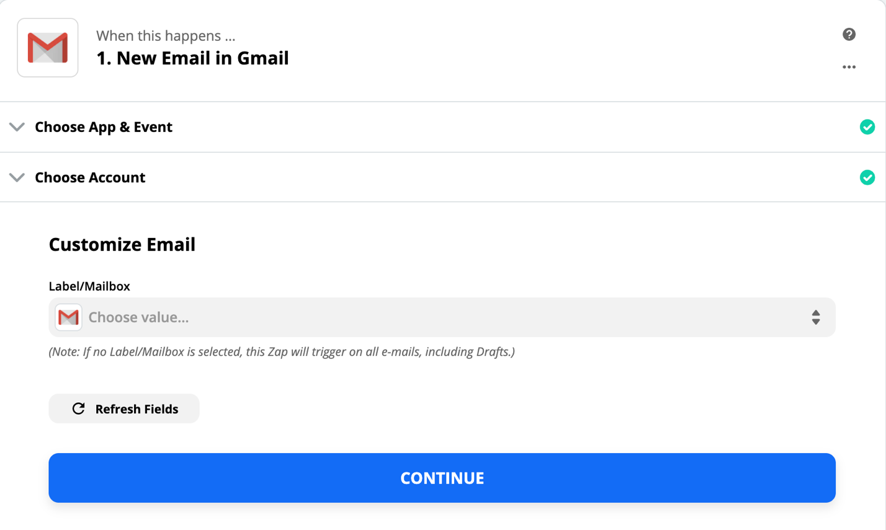
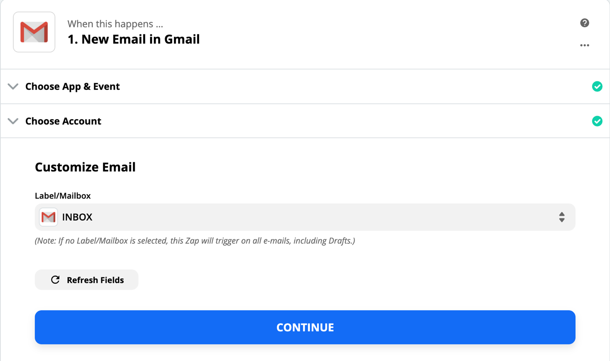

Once you have moved on to the next step, you’ll be asked either to select Test & Review, Test & Continue, or Skip Test. To run the test, click Test & Review or Test & Continue. It should be noted that, for the Trigger test to work, you must already have at least one email in your Gmail Inbox. If you want to use different sample data, you can change the sample data in your Zap trigger. When you first set up your Zap trigger, Zapier will attempt to find some sample data from your Gmail mail boxes to use in the Zap. For example, if your trigger brings in data from your mailbox, Zapier will pull in an item of Trigger (i.e., New Email)--If Zapier is having trouble finding data for your trigger, try adding new data for the event in your trigger app. he sample row can then be used as test data in an action step later in the Zap. If you want to first review the data that Zapier pulls from your mailbox, click on Test & Review. Otherwise, click on Test & Continue (If Zapier finds an example item, you’ll proceed to set up the rest of your Zap) or Skip Test to move onto the action. Please ensure any fields labelled as “required” are completed.

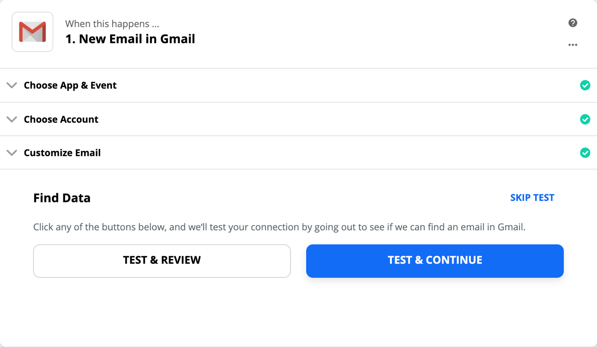
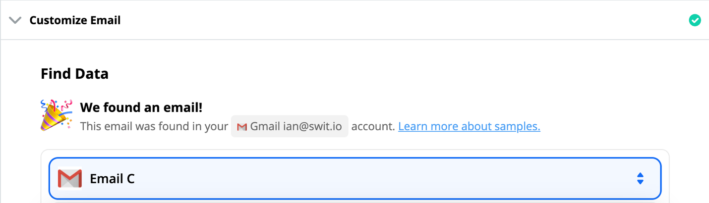

### Do this ... 

In the blank box under Choose App & Event, search for Swit and add it in.

Then look through the action events in Choose Action Event to find the one you want.

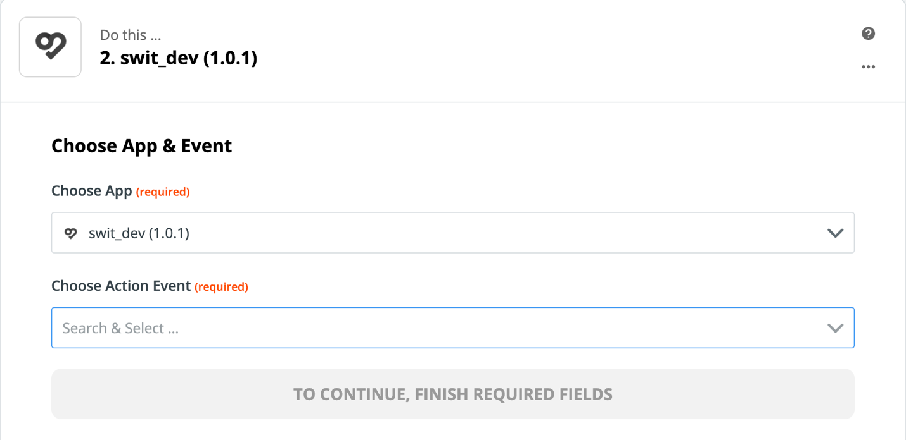

- Create Message: Posts a message on a channel you select
- Create Ideas: Posts an idea on a channel you select
- Create Task: Creates a task in a project you select
- Create Comment on Task: Posts a comment to a task you select

I will choose Create Task to demonstrate. Click on Continue to proceed.

Moving onto the next step, you need to connect your Swit account. Click on the Choose Account dropdown menu and select your existing Swit account. Once you have made the selection, click Continue.

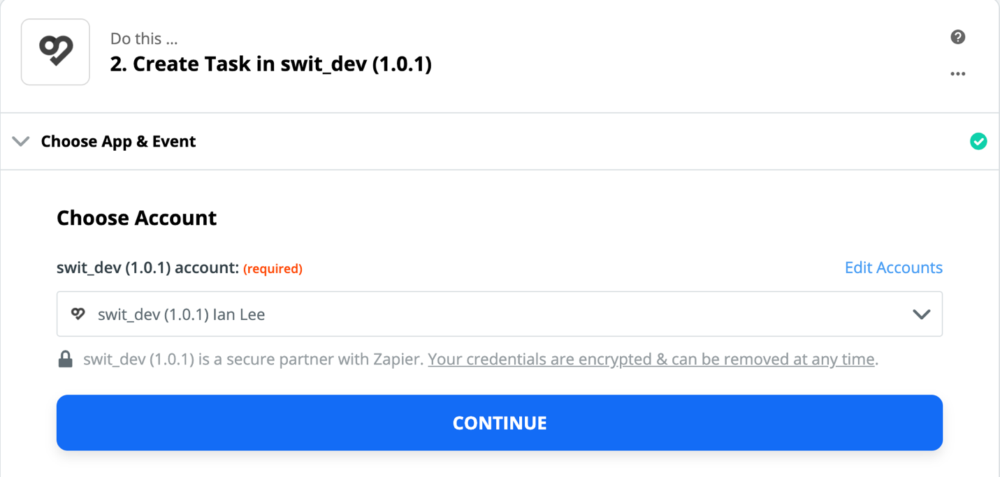

You will then be prompted to Customize Task, where you can customize the data that you want to send over to your action app, Swit.  When there is a field with an arrow on the right, click the arrow to choose from available options. In the screenshot below, I’ve already clicked the dropdown for “Workspace,” “Project,” “Task Title,” “Task Description” and selected “Zapier Test,” Gmail TEST,” “Subject,” “Body Plain” to demonstrate. And I’ve also clicked the dropdown for “Status,” “Priority,” “Assign,” “Tag” and selected “To Do,” “High,” “Ian Lee,” “Gmail” to demonstrate.

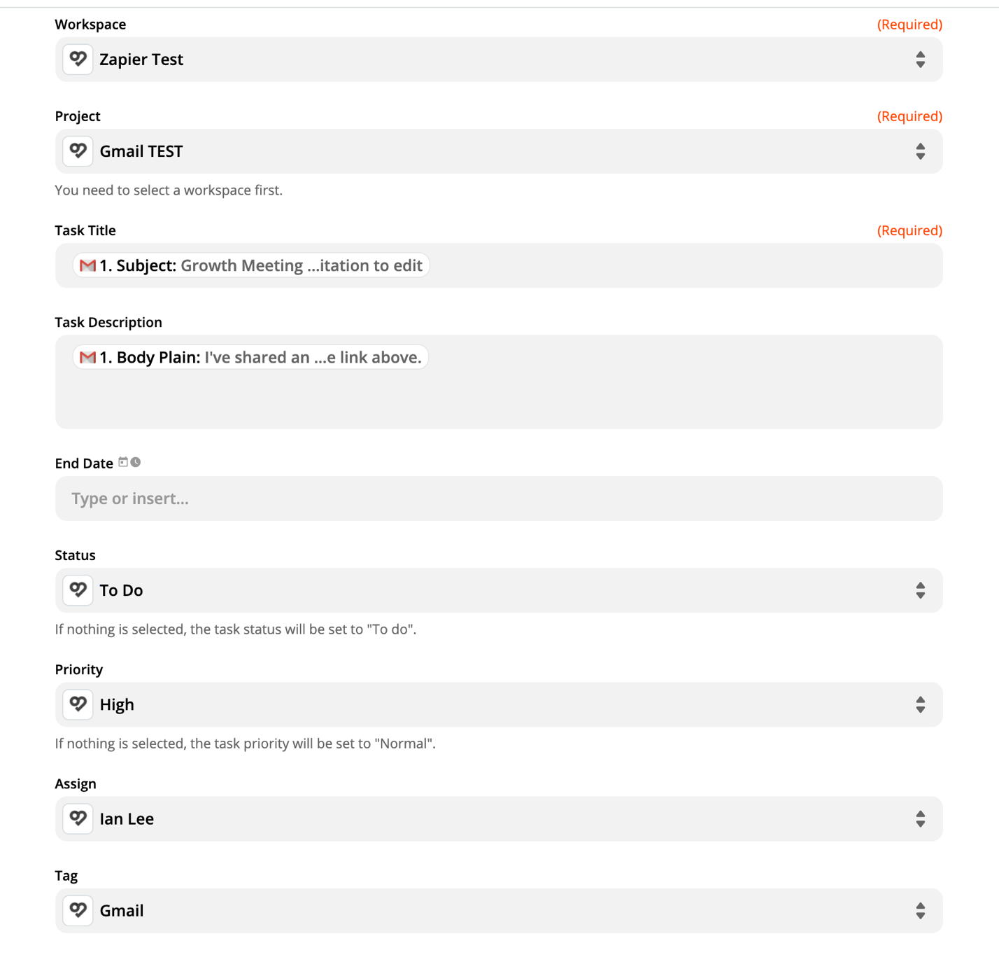

Just like testing the trigger, now you should click on Test & Continue. If there is something wrong, it will prompt you. Otherwise you should see this green box, noting, “A Test task was sent to swit_dev (1.0.1) just now.”

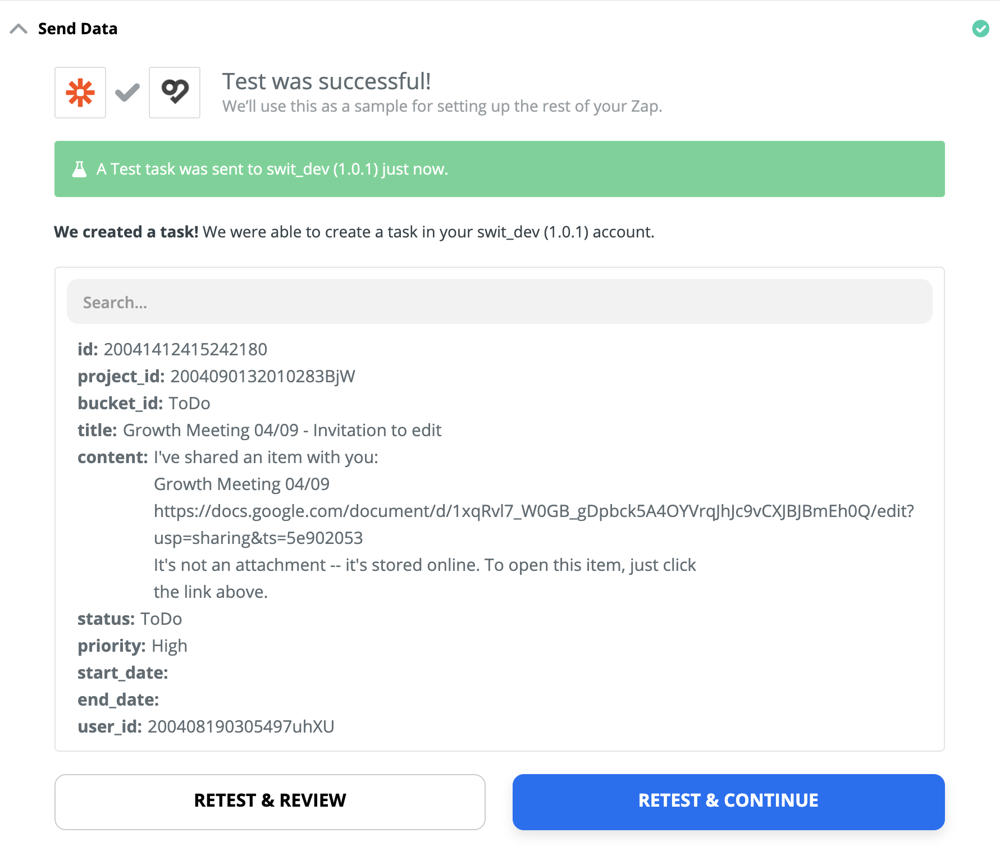

Now, jump over to Swit Workspace and check if the task card was correctly created.

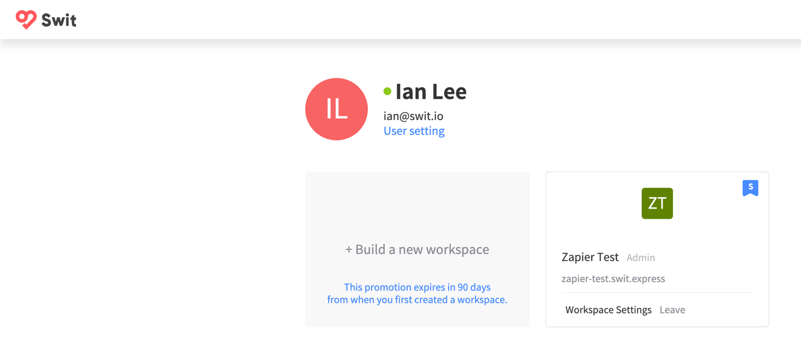

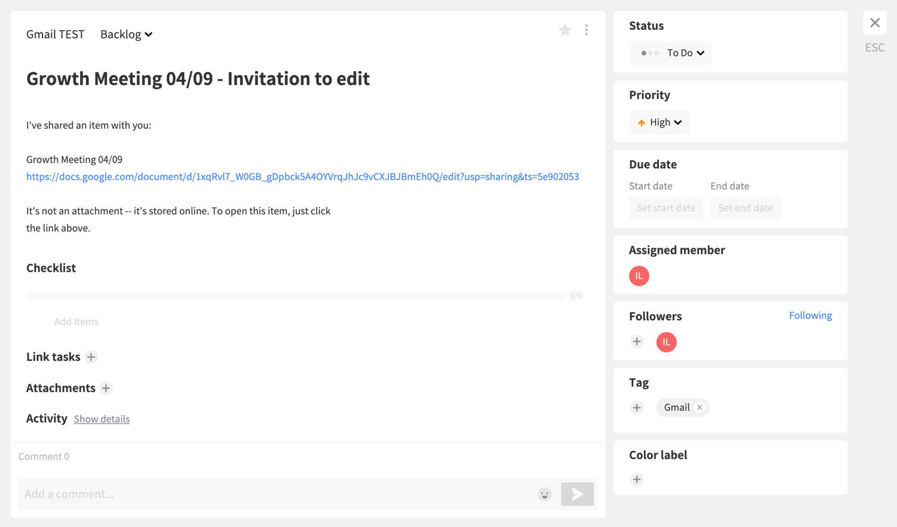

Now let’s view side-by-side comparison. As you can see, they match each other perfectly! Always check this way to make sure your Zap is configured correctly.

If all of the above is configured correctly, you’ll now have the option to turn your Zap on. You can do this by clicking the button that appears on the modal window, or by sliding-right the switch in the top right-hand corner.

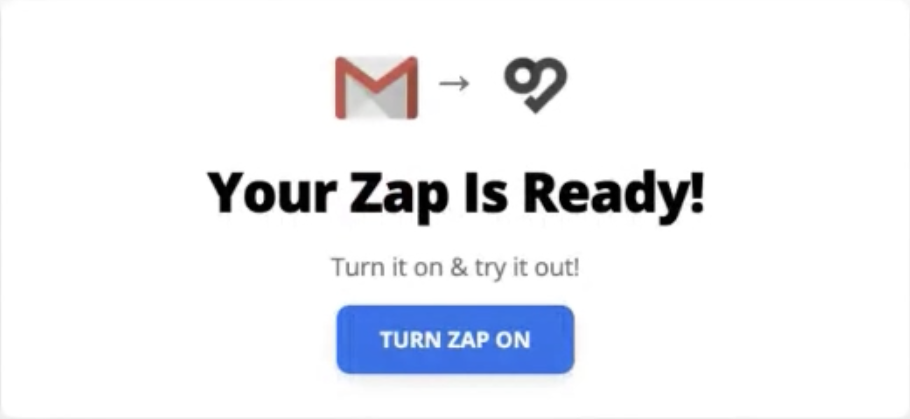
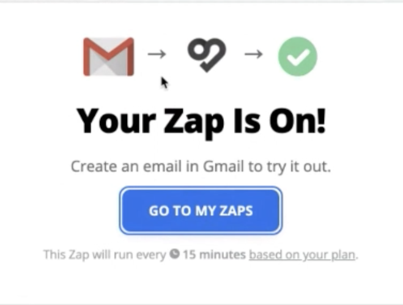

That’s it! Your first Zap is complete.

## Teamwork Projects & Swit

The purpose of this section is to demonstrate how to set up Zapier to automatically push data from Teamwork Projects to Swit. In order for Zapier to perform this task, you must first connect Teamwork Projects and Swit to Zapier. This will give Zapier secure access to read and/or write data to those apps. Please login to your Zapier and then follow the step-by-step directions below. Please keep in mind that, during setup, you’ll need to have your login credentials ready for all of the apps you want to connect.

### Getting Started

On the left-hand side of the screen, you find the Make a New Zap button when you hover your mouse cursor over the + sign. Click on the link to proceed.

