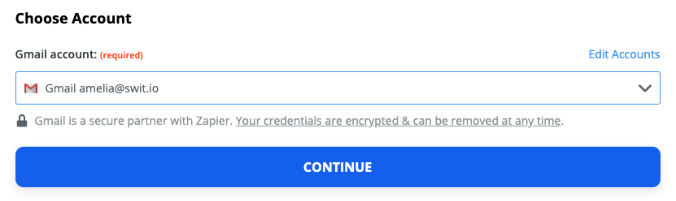
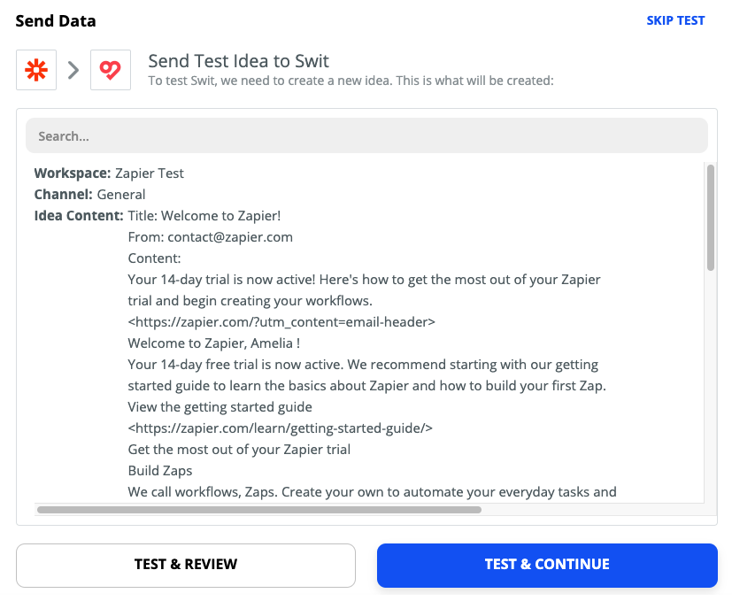

# Automate with Zapier

## What is Zapier?
 
[Zapier](https://zapier.com/) is an online automation tool that connects your apps, such as Gmail, Team Projects, and more, to each other. You can connect two or more apps to automate repetitive tasks without coding or relying on developers to build the integration. It's easy enough that anyone can build their own app workflows with just a few clicks.

## Use cases with Swit

Using the Zapier service, you can create various automated workflows with Swit. The following are a few example use cases:

- **Gmail → Swit:** Post a new Swit idea from every new email arriving into your Gmail inbox
- **Zoom → Swit:** Post a new Swit message to notify each time a new Zoom meeting is created
- **Jira → Swit:** Post a new Swit message to notify each time a new Jira issue is created
- **Swit → Google Sheets:** Keep track of Swit task activities in a Google Sheets spreadsheet
- **Swit ↔ Google Calendar:** Create a new Google Calendar event from every new Swit task you create, or vice versa

In addition to the single-step automations exemplified above, you can establish more complicated workflows involving three or more apps, e.g., Gmail → Swit → Google Sheets.

## How Zapier integrations work
 
Each automated workflow established is called a "Zap." Every Zap consists of a **trigger** step ("when this happens…") and one or more **action** steps ("then do this…"). When you turn your Zap on, it will run the action steps every time the trigger event occurs.

For example, if a Zap is to post a new Swit idea from each new Gmail email, its trigger and action will be set as follows:

- **Trigger:** New Email in Gmail
- **Action:** Create Idea in Swit

The following subsection illustrates a step-by-step guide on making this Zap. Despite the countless possible combinations of apps on Zapier, this example will help you understand how to combine two or apps into a Zap.

## How to make a Zap

This subsection will walk you through how to set up a Zap by taking an example of a Zap automatically pushing Gmail data to a Swit channel.

### Get started with your Zapier account

To implement a Zap, your Zapier account needs to be granted access to all involved apps.

1. Make sure you have both Gmail and Swit accounts that will be used in the Zap to make.
1. Visit [https://zapier.com](https://zapier.com) and sign in to your Zapier account. If you don't have an account, sign up.
1. Hover over the sidebar, or tap on ≡ in the top-left corner in the case of a touch input device, to bring out the panel, then select **MAKE A ZAP**.

### Set up your trigger

You will have been directed to the trigger setup page labeled **1. When this happens …**. A trigger is the event that starts a Zap. Once you've set up a Zap, Zapier will monitor for that trigger event.

Follow the steps below to set up a trigger:

1. Under **Choose App & Event**, search for and select the **app** that will trigger the Zap.

    

1. Click the **Choose Trigger Event** dropdown and select the event that occurs in the selected app that will trigger the Zap. In this example, it is set to trigger each time a new email is received in a specified Gmail mailbox. Once done, click **CONTINUE**.

    

1. Moving onto the next step, choose the app account you want to use in the trigger, then click **CONTINUE**.

    - If you are not signed in to the trigger app, you will be required to sign in first.

    

1. Customize your trigger options. Be sure to select or fill in any required fields. Varying with the app and event, this form is mainly focused on specifying the scope of the trigger event. Once done, click **CONTINUE**.

    

1. Click **Test trigger**.

    

    Zapier will attempt to find a recent item from your trigger app to use in the Zap. For example, if your trigger is a new email in Gmail, Zapier will pull in a recent email you've received.

    

    If you want to see another item's data, click the dropbox and choose another one. Once done, click **CONTINUE** to proceed.

    If no matching data is found, you'll be prompted to either skip the test or try again after adding new data for the event.

    
    
    Although this step is not mandatory, it helps understand the data fetched by the trigger, as shown below, which will be used in an action step later in the Zap.

### Set up your action

After you set up your Zap trigger, the next step of **2. Do this …** is to add an action to your Zap. An action is a job your Zap performs when your trigger event occurs.

Follow the steps below to set up an action:

1. Under **Choose App & Event**, search for and find the **app** you want to use in your action.

    

1. Click the **Choose Action Event** dropdown and select the action that you want your Zap to perform. In this example, the action is set to create an idea on Swit from each new Gmail email arriving. Once done, click **CONTINUE** to proceed.

    

1. Moving onto the next step, choose the app account you want to use in the action, then click **CONTINUE**.

    - If you are not signed in to the trigger app, you will be required to sign in first.

    

1. Customize the data that you want to send over to your action app. Varying with the app, trigger, and action, this form is mainly focused on specifying the following:

    - The specific destination where the selected action will be conducted (In this example, **Zapier Text** workspace > **General** channel)
    - The data to be used by the action, which may include elements of the trigger event and additional items in different data types (In this example, the incoming email's sender, title, and content, along with their labels added in plaintext)

    Once done, click **CONTINUE** to proceed.

    

1. The final step is to see if your action works as expected. The following screen will show you the data input for your action—that's the data that's being sent to your action app. To run the action step, click **Test & Continue**.

    

1. If the test is successful, all sections will be folded to show the following screen. To view the test details, click the folded **Send Data** section.

    

1. Once you’ve set up your Zap action, you can click **Done Editing** to finish or click on + to add another action.

### Name your Zap

Next, give your Zap a name so you can easily identify it on your dashboard.

- In the upper left, click **Name your Zap** and enter a new name for your Zap, or

- To add more information about your Zap, give your Zap a description, click the  icon in the right sidebar to open the Settings tab, then fill in the fields. Your changes will be saved automatically.

    

### Turn on your Zap

After you set up, customize, and name your Zap, you're ready to turn it on. In the upper right, click to toggle the switch ON.

Once your Zap is turned on, Zapier will run your action steps each time your trigger event occurs.

## See if the Zap works properly

Let's send an email to the connected Gmail account to test if the Zap works properly as defined:

Now, jump over to the specified destination (**Zapier Text** workspace > **General** channel > Idea forum), and check for a new post created from the incoming email.

You'll find a new idea post containing the content of the sent email in the defined format.

Thus, we've created a very simple Zap. Using the various triggers and actions provided by Swit and 2,000+ other apps, you can design and use much more sophisticated and useful automations suited to your workflows. To learn all details about Zaps and their various possible applications, see the [Zapier Help documentation](https://zapier.com/help).