# Integrate Zoom Features

The Zoom integration enables users to schedule Zoom meetings while staying in a Swit workspace and supports sharing scheduled meetings with workspace members through invitations in channels or links with task cards.

This section covers:  

- Installation and configuration
- Using the Zoom App on Swit
- Uninstallation
- Limitations and planned updates

## Installation

1. Sign in to your Swit account and enter the workspace where you want to install the Zoom integration.
1. Click on the workspace name in the top left corner of the screen, then select **Swit Store** in the dropdown menu to visit Swit Store.

    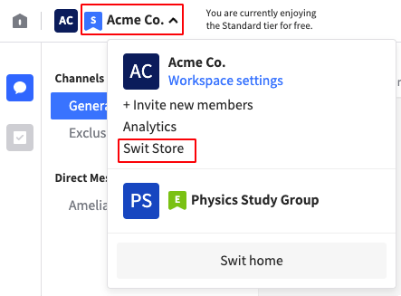

1. Find Zoom and click **Install**.

    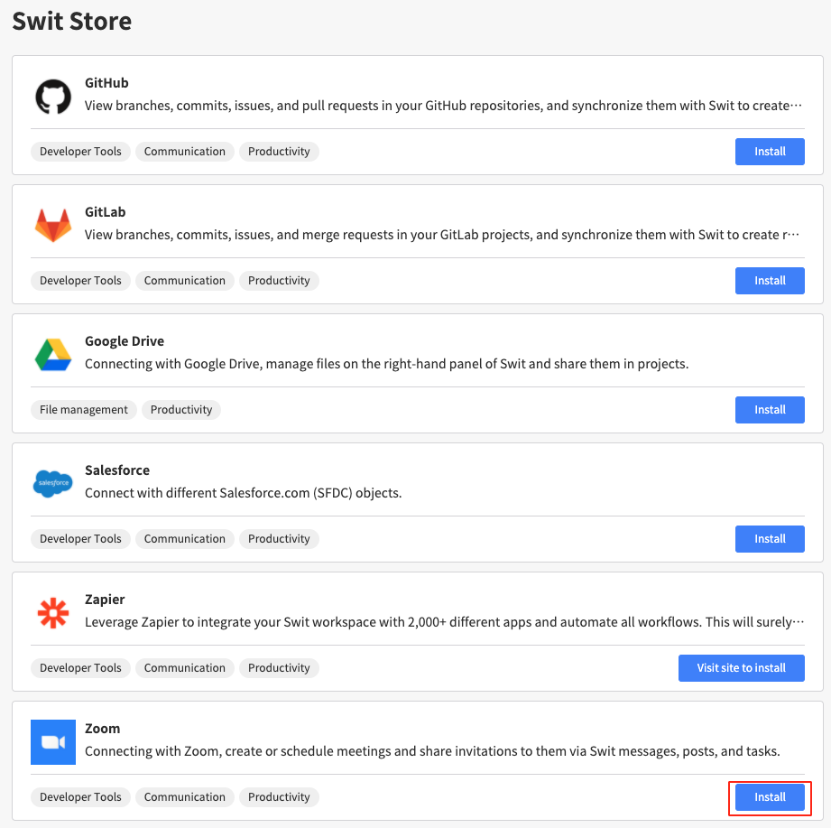

1. If the installation is successful, you’ll find the  icon on the right panel.

    - If the right panel is not pinned, hover over the  icon in the top right corner to open it.

## Configuration

1. Click on the  icon on the right panel, then **click Sign In with Zoom**.

    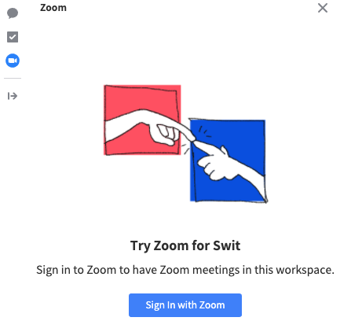

1. Once signed in to Zoom, you will be prompted to allow permissions for the integration. Click **Authorize** to continue.

    

1. If the authorization is successful, a Zoom UI will be given along with all scheduled meetings retrieved from your Zoom account. Now the Zoom app is now ready to use.

    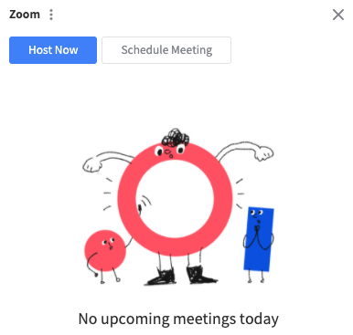

1. If you want to disconnect your Zoom account from the workspace, click on the  icon next to the **Zoom** app title, then select the disconnection option.

## Using the Zoom App on Swit

Swit allows hosting Zoom meetings in four different places:

- Right panel
- Channel box > Chatroom
- Channel box > Idea forum
- Project box > Task card

### Use in the right panel

The main Zoom UI is provided on the right panel.

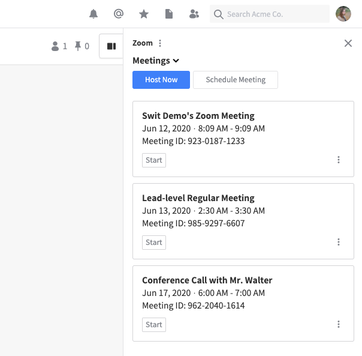

The right panel consists of two controls (**Host Now** and **Schedule Meeting**) and a list of upcoming meetings.

##### Host Now
This enables one-click hosting of a Zoom meeting by creating an instant Zoom meeting with default settings. The meeting is scheduled at the current time, and by sharing it, you can have workspace members join the meeting immediately.

##### Schedule Meeting
This control is used to host a fully user-customized meeting, especially including when to start and end the meeting. The specifiable settings include topic, date and time, time zone, and duration of the meeting.

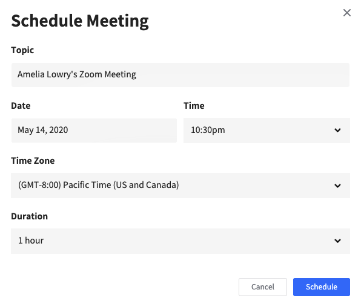

##### List of upcoming meetings
This section shows upcoming meetings you have scheduled ahead. Each meeting entry displays basic information about the meeting and provides several controls:

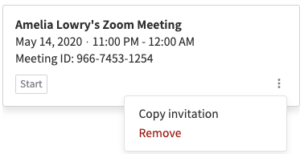

- **Start:** Launches the scheduled meeting. This will redirect you to the Zoom meeting page.
- **Copy invitation:** Copies the meeting invitation text to the clipboard. You can paste it into an email or anywhere else you would like to send it out.
- **Remove:** Removes the meeting entry from the list.

You can drag and drop this entry onto a Swit chat room or direct message to share it as an invitation for the channel members.

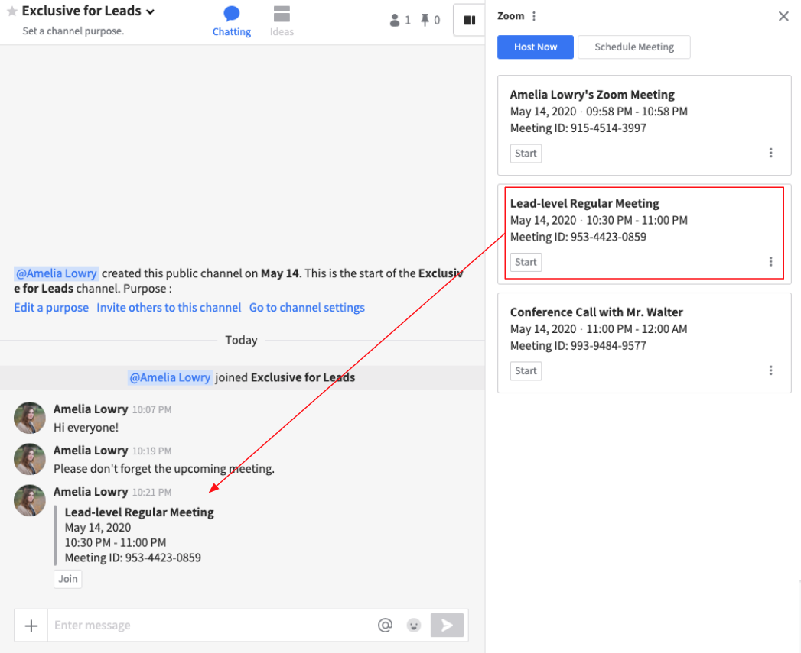

### Use in a channel

The channel provides some essential Zoom controls both in the chat room (and direct messages) and idea forum. In either space, click on + to open the menu, then select **Zoom**, and you will be given the following three items:

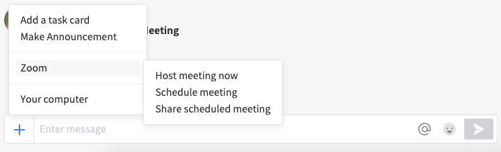

##### Host meeting now & Schedule meeting
These two controls work almost the same way as **Host Now** and **Schedule Meeting**, respectively, in the right panel. The only difference is that they automatically leave an invitation for the newly created meeting entry in the channel.

##### Share scheduled meeting
This enables you to share any previously scheduled upcoming meeting in the channel. Click this to open the following dialog box and select the scheduled meeting you want to share, then click **Confirm**.

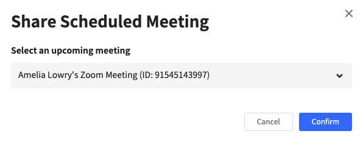

Although they provide the same Zoom features, the chat room and idea forum display invitations in significantly different formats:

##### Meetings shared in the chat room
In the chat room, members can join the meeting simply by clicking on the **Join** button.

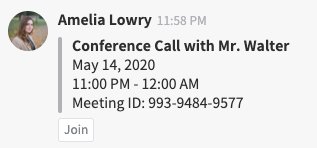

##### Meetings shared in the idea forum
Instead of giving a **Join** control, the idea forum posts a full text of the invitation, including the meeting URL, ID, and password.

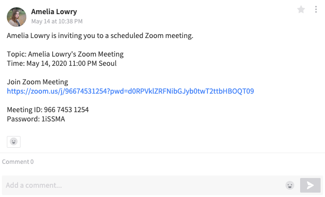

### Use in a task page

The task page provides a Zoom extension in the right bottom corner, allowing you to share invitations to relevant meetings. It supports similar Zoom features to those of the channel.

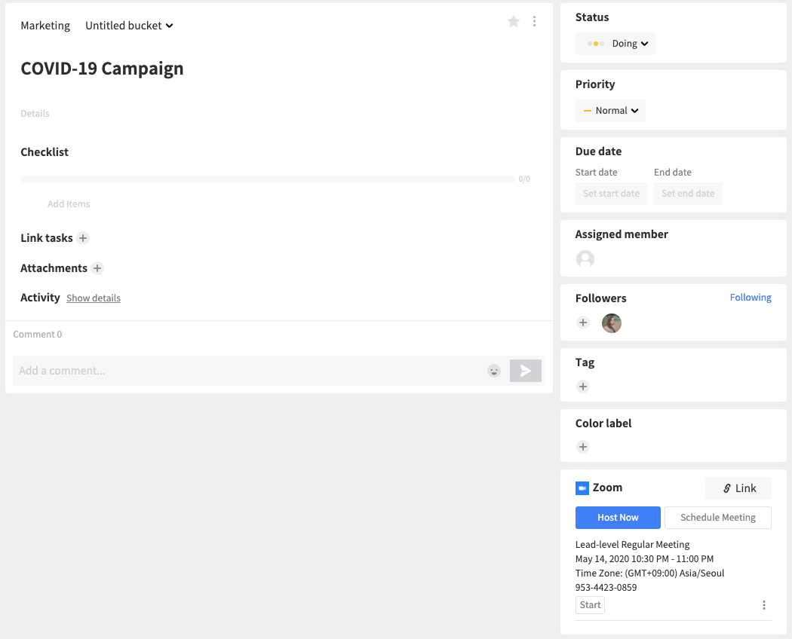

##### Host Now & Schedule Meeting
These two controls work almost the same way as **Host Now** and **Schedule Meeting**, respectively, in the right panel. The only difference is that they automatically leave an invitation for the newly created meeting entry in the task card.

##### Link
This enables you to share any previously scheduled upcoming meeting in the task card. Click this to open the following dialog box and select the scheduled meeting you want to share, then click **Confirm**.

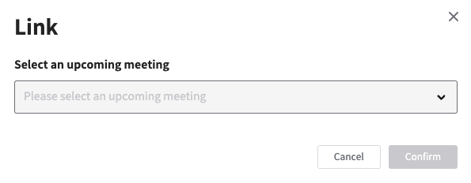

##### List of linked meetings
This section shows upcoming meetings linked with the task. Each meeting entry displays basic information about the meeting and provides several controls:

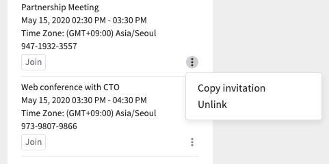

- **Join:** Project members can join the meeting by clicking on this button.
- **Copy invitation:** Copies the meeting invitation text to the clipboard. You can paste it into an email or anywhere else you would like to send it out.
- **Unlink:** Deletes the link with the task.

## Uninstallation

1. Visit the Swit Store page for the relevant workspace.
1. Find Zoom and click **Manage**.
1. Click **Uninstall**.
1. Read the dialogue and click **Confirm**.

## Limitations

- Yet to support designating attendees in a Zoom meeting. This feature will be added in version 2.0. 

- A maximum of 100 meetings can be created/updated for a single user in one day.
