# Sync with GitHub

The GitHub integration supports synchronous connections between your GitHub account and Swit workspace. This enables automatic creation of reports or task cards in a Swit workspace from each new event in a GitHub repository, and the other way around as well.

## Actions, the basic unit of GitHub integration

Each single workflow established between Swit and GitHub is called an "action." The action is basically a pair of a **triggering** and a **triggered** event, for example,

- **Triggering:** When an issue is opened in a particular **GitHub** repository
- **Triggered:** A notification message is created in a particular **Swit** channel

The screen below shows some of the different actions available. Using a collection of these actions, you can build a fully interactive, instant, bidirectional synchronization between the two services.

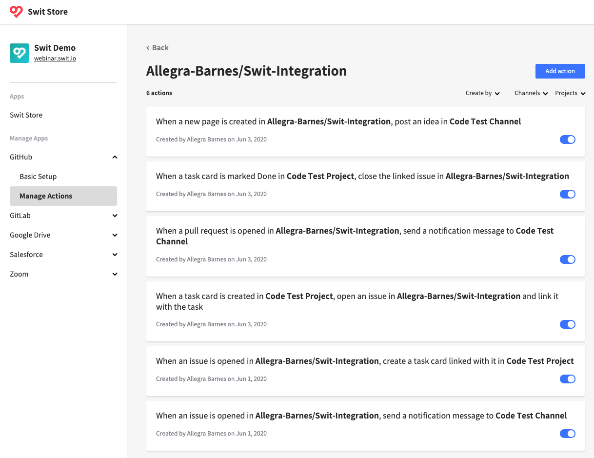

## Get started

You can start using the GitHub integration by adding an action.

### Different approaches to adding an action

For user convenience, actions can be added from various access points:

- **Add an action from Store:** In Swit Store's left menu, select **GitHub** > **Manage Actions**, then click on **Add action** in the body section.

    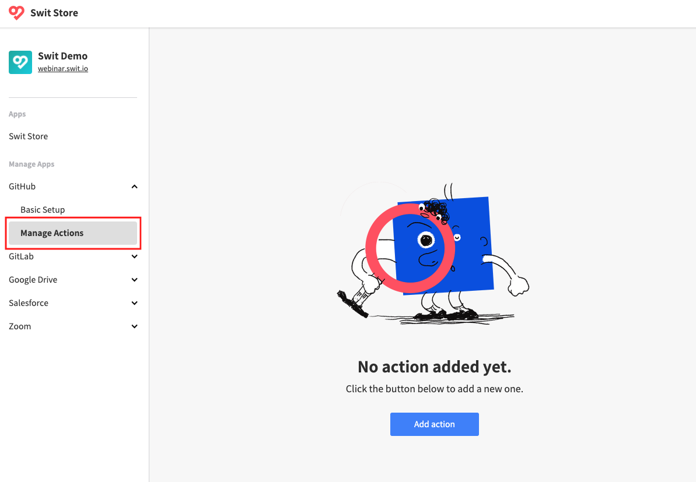

- **Add an action from a channel/project:** In a channel or project, click on {: class="icon" } in the top-right corner, then click on **Add action** in the next page. In this case, the selectable actions are limited to those relevant to the particular channel or project you are in.

    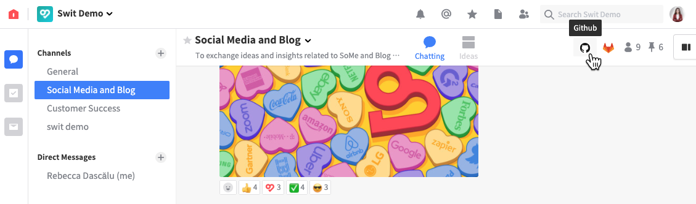

- **Add an action from a task card:** In a task card, find the GitHub box in the bottom-right corner, then click on **Link** in it. In this case, the selectable actions are limited to those relevant to the task.

    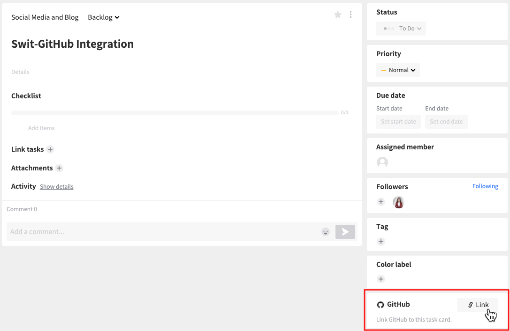

Because you have not yet authorized access to your GitHub account from the workspace, you will be asked to connect a GitHub account.

### Authorize with a GitHub account

When prompted to authorize with your GitHub account, follow the steps below:

1. Click **Connect** to proceed.

    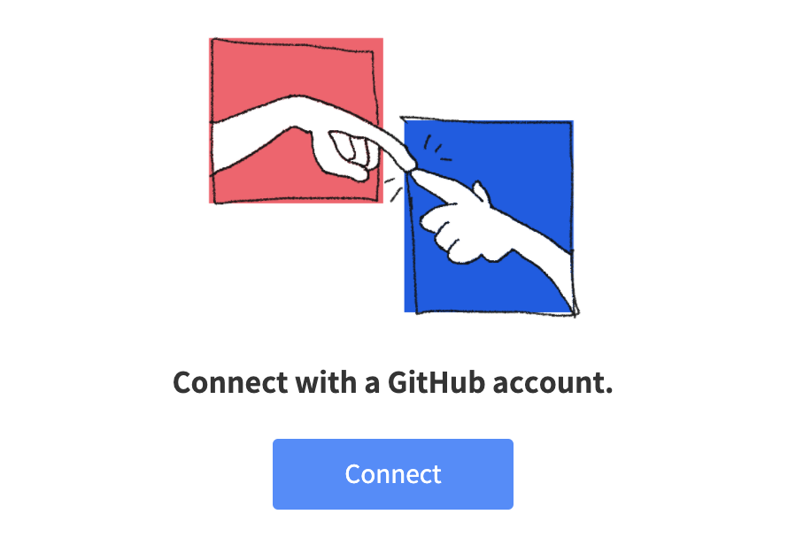{: width="400px" }

1. You will be directed to the authorization page. Authorize access from your Swit account.

    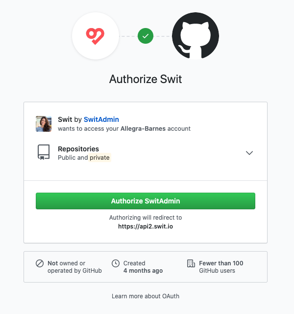{: width="500px" }

1. If you need multiple GitHub accounts connected, try adding an action once again as guided in previous subsection until the following screen appears, then select **Use another account**.

    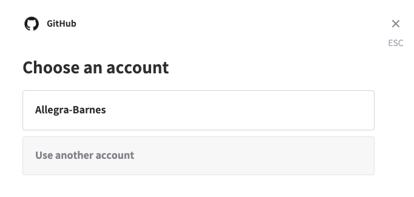{: width="550px" }

Once successfully authorized, you are ready to add an action to sync with a GitHub repository.

## Add actions in a channel

The actions provided for Swit channels are to notify the channel members of each relevant event occurring in a GitHub repository, including:

- Issues opened
- Issues closed
- Commits pushed
- Pull requests opened
- Pull requests merged
- Pages created

These event notifications can be either as **chat messages** or **idea posts**.

Follow the steps below to add an action in a channel. Although we here take one example action, all channel-targeted actions can be established almost in the same way.

1. Start adding an action in either way below:

    - In Swit Store, select **GitHub** under the **Manage Apps** heading, then click on **Add an action**.
    - In the channel page, click on {: class="icon" } in the top-right corner, then click on **Add an action**.

    !!! Note
    
        If GitHub access is not yet authorized, you will be asked for it first. See [Authorize with a GitHub account](#authorize-with-a-github-account).

1. Choose the action you want to add, considering:

    - Which kind of GitHub event you want to get notified of
    - Whether to create chat messages or idea posts from those GitHub events

    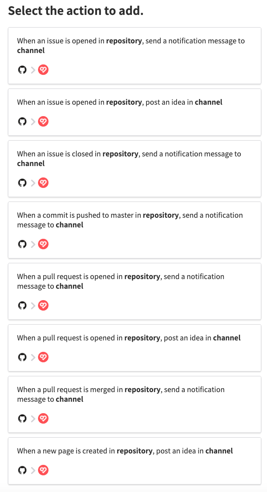{: width="500px" }

1. Select a GitHub repository and a Swit channel that you want to connect, then confirm your action setup.

    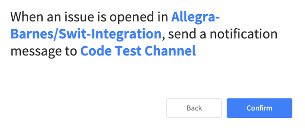{: width="500px" }

1. If successful, you will be directed where you can view all actions you have added (See Section [Manage actions](#manage-actions) for more details about this page).

    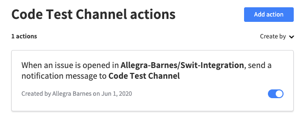{: width="500px" }

    !!! Note

        If you have reached the action-adding page from a particular channel but selected a different channel therein, the added action won't be shown because it does not belong to the current channel.

1. To test the action, perform the relevant event. For example, if you have added an action triggered by a new issue opened, open a new issue in the synced GitHub repository.

    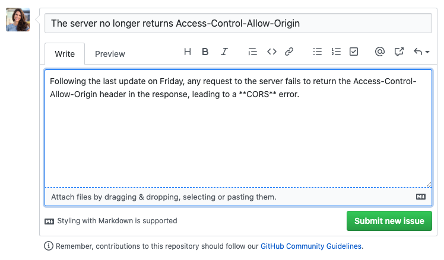{: width="600px" }
 
1. Check if the test event in GitHub was successfully reported in the channel, either as a chat message or idea post as specified by the action.

    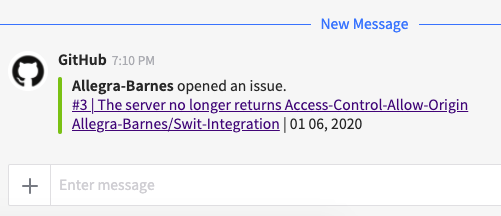

## Add actions in a project

The actions available in projects are mainly focused on synchronizing the creation and completion of Swit task cards and GitHub issues or pull requests in a **bidirectional** way. For example, an issue opened in a GitHub repository can trigger a task card to be created in a Swit project; or conversely, when a task is marked Done, the linked issue can synchronously be closed.

This way, you can interact with your GitHub collaborators while staying within the Swit workspace.

Follow the steps below to add an action in a project. Although we here take one example action, all project-targeted actions can be established almost in the same way.

1. Start adding an action in either way below:

    - In Swit Store, select **GitHub** under the **Manage Apps** heading, then click on **Add an action**.
    - In the project page, click on {: class="icon" } in the top-right corner, then click on **Add an action**.

    !!! Note
    
        If GitHub access is not yet authorized, you will be asked for it first. See [Authorize with a GitHub account](#authorize-with-a-github-account).

1. Choose the action you want to add, considering:

    - Which kind of GitHub event you want to sync with
    - The direction of sync:
    
        - {: class="icon" } When GitHub issues/pull requests are opened/closed, create/mark Done Swit tasks, or
        - {: class="icon" } When Swit tasks are created/marked Done, open/close GitHub issues

    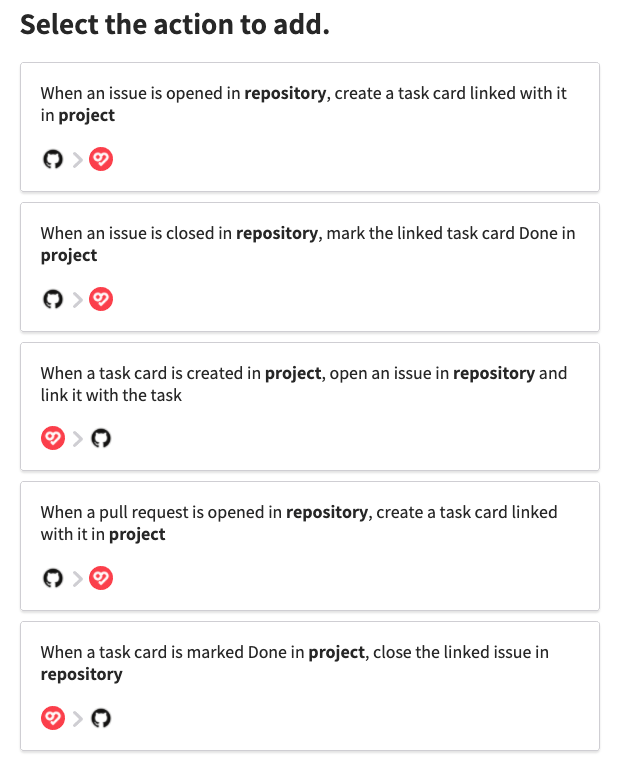{: width="500px" }
    
1. Select a GitHub repository and a Swit project that you want to sync, then confirm your action setup.

    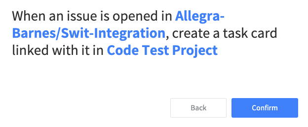{: width="500px" }

1. If successful, you will be directed where you can view all actions you have added (See Section [Manage actions](#manage-actions) for more details about this page).

    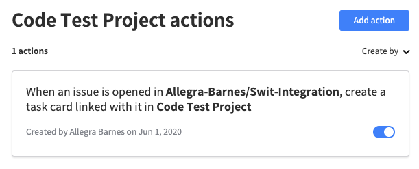{: width="500px" }

    !!! Note

        If you have reached the action-adding page from a particular project but selected a different project therein, the added action won't be shown because it does not belong to the current project.

1. To test the action, perform the triggering event and check for a synchronous occurrence of the counterpart event. If you have selected "When an issue is opened in **repository**, create a task card linked with it in **project**," for example, open an issue in the selected GitHub repository and see if a corresponding tack card has been created in the Swit project.

    - An issue opened in the GitHub repository:

        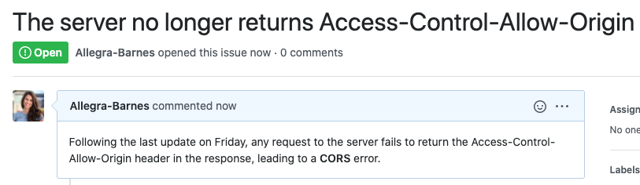

    - A task card created in the Swit project:

        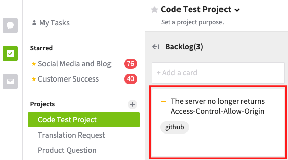

    !!! Note
    
        Some actions work in the opposite direction, i.e., an event in the Swit project triggers its corresponding event in GitHub repository. In that case, test the action by performing the event on the Swit project side and check for the synchronous event in the GitHub repository.

1. Whether a Swit task is created in sync with a GitHub issue or pull request, or it happens the other way around, the task will be attached with a direct link to the GitHub counterpart. This link is used for synchronous completion of the task and issue/pull request, and also helps task followers conveniently visit and view the GitHub article.

    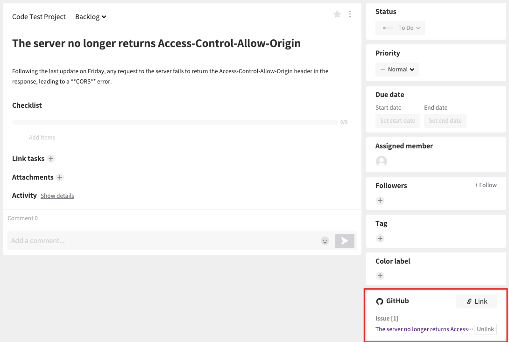

    See the following section of [Attach task cards with links to GitHub pages](#attach-task-cards-with-links-to-github pages) for more details about these links.

## Attach task cards with links to GitHub pages

The task details page can be added with links to objects of various Store apps, including GitHub, in its bottom-right corner.

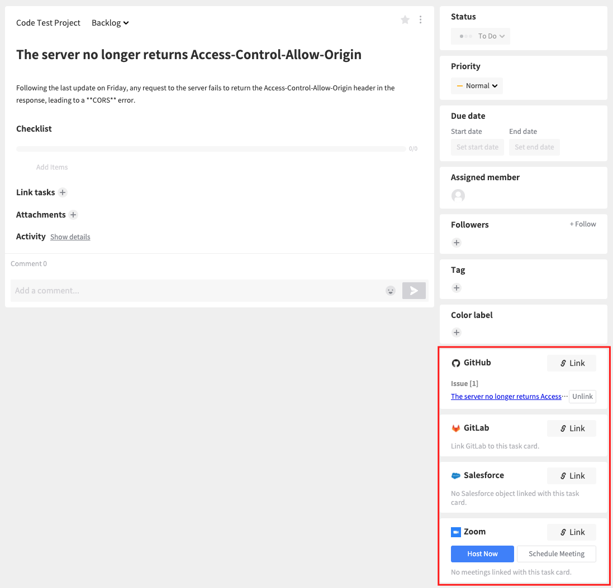

For the GitHub integration, the linkable pages include:

- Branches
- Issues
- Pull requests
- Commits

You'll find any task cards synced with a GitHub issue or pull request already include a link to the relevant GitHub page. To add a new link to a task card:

1. Click on **Link** in the GitHub box to open the page to add a link.

1. Choose a GitHub account you want to connect.

    {: width="550px" }

1. Select the repository, the page type, and then the specific page you want to link with.

    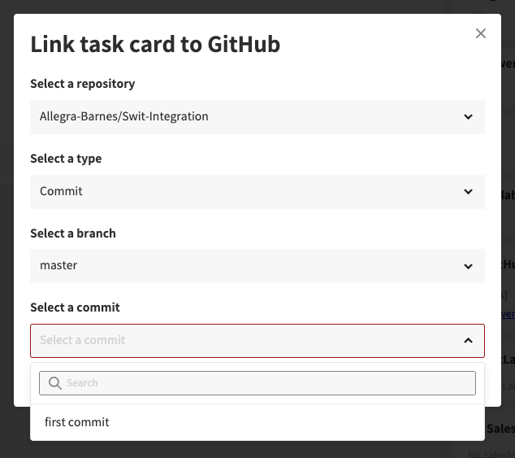{: width="550px" }

1. Find the new link added in the GitHub box. Click **Unlink** next to the link if you want to remove the link.

    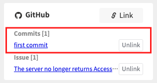

## Manage actions

You can manage established actions in two ways:

- To view and manage all actions added in the workspace, go to Swit Store and under **Manage Apps**, select **GitHub** > **Manage Actions**. And you will be prompted to select the repository that includes the actions you'd like to manage.

    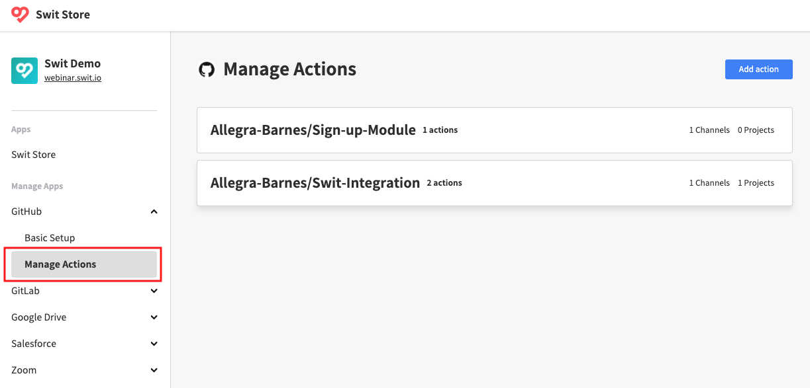

- Clicking on {: class="icon" } in a particular channel or project page will show you all actions belonging to the channel/project.

    

The action list page provides controls to sort, add, edit, delete, and turn on and off actions. Note that the Edit {: class="icon" } and Delete {: class="icon" } icons appear when an action item is hovered over.

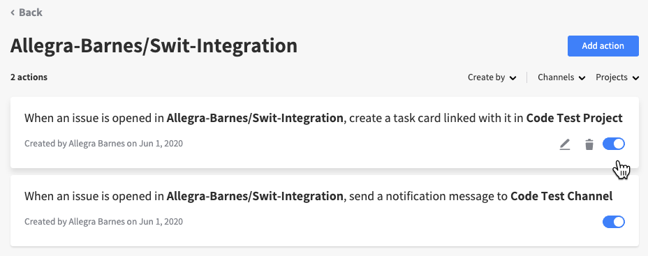